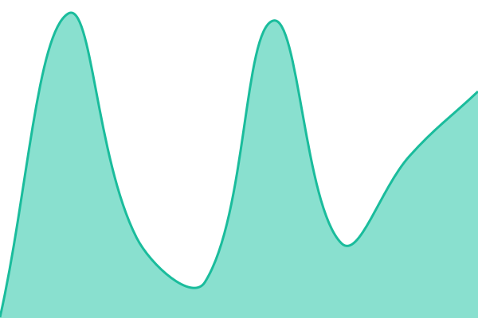

# [📈 Live Status](https://inprod.github.io/upptime/): <!--live status--> **🟩 All systems operational**

This repository contains the open-source uptime monitor and status page for [inprod](https://demo.upptime.js.org), powered by [Upptime](https://github.com/upptime/upptime).

<!--start: status pages-->
<!-- This summary is generated by Upptime (https://github.com/upptime/upptime) -->
<!-- Do not edit this manually, your changes will be overwritten -->
<!-- prettier-ignore -->
| URL | Status | History | Response Time | Uptime |
| --- | ------ | ------- | ------------- | ------ |
|  [InProd Website](https://www.inprod.io) | 🟩 Up | [in-prod-website.yml](https://github.com/inprod/upptime/commits/HEAD/history/in-prod-website.yml) | 

 253ms
     
 | 

<a href="https://inprod.github.io/upptime/history/in-prod-website">100.00%</a>
    

|  [InProd DEV](https://dev.inprod.io) | 🟩 Up | [in-prod-dev.yml](https://github.com/inprod/upptime/commits/HEAD/history/in-prod-dev.yml) | 

 690ms
     
 | 

<a href="https://inprod.github.io/upptime/history/in-prod-dev">100.00%</a>
    

|  [InProd PROD](https://red.au.inprod.io) | 🟩 Up | [in-prod-prod.yml](https://github.com/inprod/upptime/commits/HEAD/history/in-prod-prod.yml) | 

 582ms
     
 | 

<a href="https://inprod.github.io/upptime/history/in-prod-prod">100.00%</a>
    

<!--end: status pages-->

## 📄 License

- Powered by: [Upptime](https://github.com/upptime/upptime)
- Code: [MIT](./LICENSE) © [Anand Chowdhary](https://anandchowdhary.com), supported by [Pabio](https://pabio.com)
- Data in the `./history` directory: [Open Database License](https://opendatacommons.org/licenses/odbl/1-0/)
